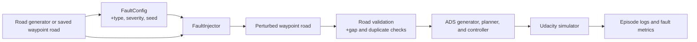

# ADS Geometric Fault Injector

The ADS Geometric Fault Injector applies controlled corruption to waypoint-based road maps. It makes map and localization errors repeatable so an automated-driving system (ADS) can be evaluated for path tracking, curve handling, and recovery before a full closed-loop campaign.

## Problem

ADS validation commonly emphasizes perception perturbations or hand-picked driving scenarios. This module addresses a different failure mode: **a road map whose waypoint geometry is incomplete, displaced, overly curved, or noisy**. It provides deterministic fault configurations that make it possible to measure how those errors propagate into planning and control failures, while retaining roads that are valid enough to run in the simulator.

The injector is intended to help users:

- emulate map corruption and localization inconsistencies;
- expose weak path tracking, turning, and recovery behavior;
- compare results across runs using fixed random seeds; and
- vary attack severity systematically rather than selecting scenarios ad hoc.

## Architecture and Data Flow



`FaultInjector.inject(road)` modifies only the x/y coordinates or the waypoint sequence; waypoint metadata such as z and width is preserved. `main_fault.py` attaches the injector to `RandomTestGenerator`, then records the selected fault type, severity, label, and outcome in its run logs.

## Algorithms and Libraries

### Fault models

| Fault | Algorithm | Severity |
| --- | --- | --- |
| F1 waypoint displacement | Randomly select a fraction of waypoints and move them by a fixed distance in random directions. | Displacement in metres |
| F2 curvature injection | Add a smooth, lateral sinusoidal bump over a contiguous waypoint window. The window can be placed at peak curvature, an entry region, or randomly. | Maximum lateral amplitude in metres |
| F3 waypoint dropout | Remove interior waypoints randomly or in contiguous blocks. Contiguous dropout favours high-curvature regions; boundary kinks and gap repair maintain a runnable road. | Fraction of interior waypoints removed |
| F4 noise injection | Add zero-mean Gaussian noise to every waypoint's x/y coordinates. | Gaussian standard deviation in metres |

### Supporting techniques

- Seeded pseudo-random streams provide reproducible injections.
- Curvature estimation identifies challenging regions for contiguous dropout.
- Road validation checks waypoint count, excessive dropout, maximum gaps, and near-duplicate points.

### Libraries

- `numpy>=1.20` is the only dependency required by the injector itself.
- The full simulator workflow is provided by the repository's root dependency set and uses the Udacity simulator, Gym, SciPy, and the configured ADS model.

## Repository Contents

- `fault_injector.py`: fault taxonomy, configuration, injection algorithms, severity presets, and validation helpers.
- `dry_run_faults.py`: command-line analysis utility for comparing original and perturbed roads.
- `integrate.py`: integration reference for adding the injector to a generator pipeline.
- `tests/test_fault_injector.py`: unit tests.
- `assets/`: visual examples of the four fault types.
- `requirements.txt`: injector-only dependency list.

## Active Fault Set

- `F1_waypoint_displacement`
- `F2_curvature_injection`
- `F3_waypoint_dropout`
- `F4_noise_injection`

## Fault Visualizations

### F1 — Waypoint Displacement


### F2 — Curvature Injection


### F3 — Waypoint Dropout


### F4 — Noise Injection


## Setup and Run Guide

Run the following commands from the repository root (`udacity-test-generation`). Python 3 is required.

### 1. Install dependencies

For injector development and unit tests only:

```bash
python3 -m pip install -r fault_inject/requirements.txt
```

For the complete simulator campaign, install the repository dependencies and the two packages imported directly by `main_fault.py`:

```bash
python3 -m pip install -r requirements.txt
python3 -m pip install gym scipy
```

Then configure the Udacity simulator executable. `main_fault.py` defaults to `/Applications/udacitysimmaxibon.app`; override this with `--udacity-exe-path` when necessary.

### 2. Use the injector in Python

```python
from fault_inject.fault_injector import FaultConfig, FaultInjector, FaultType

road = [
    [100.0, 100.0, 0.0, 3.0],
    [100.5,  99.6, 0.0, 3.0],
    [101.0,  99.2, 0.0, 3.0],
]

config = FaultConfig(
    fault_type=FaultType.WAYPOINT_DROPOUT,
    severity=0.10,
    seed=42,
    contiguous=True,
    dropout_blocks=2,
)

perturbed_road = FaultInjector(config).inject(road)
```

Waypoint inputs are normally `[x, y, z, width]`; only x/y are changed by displacement, curvature, and noise faults.

### 3. Run unit tests

```bash
python3 -m unittest fault_inject.tests.test_fault_injector -v
```

### 4. Run simulator campaigns

Use `main_fault.py`, which defines the `--fault-*` command-line options. Each run writes logs under `logs/fault_inject/` by default.

```bash
python3 main_fault.py --fault-type F1_waypoint_displacement --fault-severity 0.5 --fault-label moderate

python3 main_fault.py --fault-type F2_curvature_injection --fault-severity 1.2 --fault-label strong --fault-inject-at peak --fault-window-size 12

python3 main_fault.py --fault-type F3_waypoint_dropout --fault-severity 0.10 --fault-label strong --fault-contiguous-dropout

python3 main_fault.py --fault-type F4_noise_injection --fault-severity 0.1 --fault-label moderate
```

Add `--udacity-exe-path /path/to/simulator` if the simulator is not installed at the default path. Use `--num-episodes N` to control the number of simulator episodes. Pass `--fault-type baseline` (the default) to run without injection.

## Reproducibility and Validation

- A fixed configuration seed produces deterministic fault injection.
- Repeated injector calls use deterministic per-call offsets so consecutive roads do not receive identical random perturbations.
- Use `validate_road(road, original_len)` to check basic post-injection road sanity.

## Severity Presets

The module provides five labels—`mild`, `moderate`, `strong`, `severe`, and `extreme`. Exact per-fault values are defined by `SEVERITY_SWEEPS` in `fault_injector.py`.
